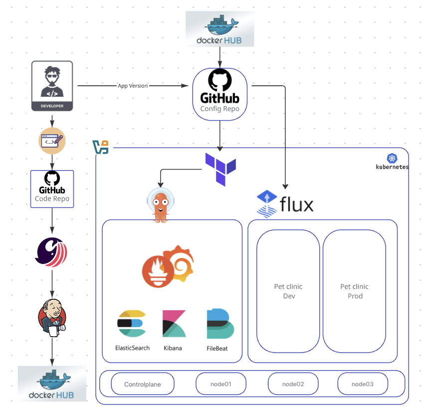

# 👋 Hi, I’m Riz

I’m a DevOps enthusiast with hands-on experience in CI/CD pipelines, GitOps workflows, and Kubernetes deployments. My portfolio demonstrates practical expertise in building and managing on-prem infrastructure, automating deployments, and implementing observability and monitoring solutions.

This platform runs on a **self-hosted Kubernetes cluster across 4 Ubuntu VMs on VirtualBox**, emphasizing end-to-end DevOps skills from infrastructure provisioning to application delivery.

---

## Key Projects & Skills

- Built **CI/CD pipelines** with Jenkins, integrated with GitHub Webhooks and **SonarQube** for code quality checks.
- Implemented **GitOps workflows** using Argo CD (observability apps) and FluxCD (application workloads).
- Managed **Kubernetes clusters** using kubeadm on Ubuntu VMs, configured Calico CNI, and MetalLB for LoadBalancer services.
- Containerized applications with Docker and deployed via Helm charts and Kubernetes manifests.
- Implemented **monitoring and logging** with Prometheus, Grafana, and the ELK Stack.

---

## Tools & Technologies

GitHub, Jenkins, SonarQube, Argo CD, FluxCD, Terraform, Docker, Kubernetes, Helm, Calico, MetalLB, NGINX Ingress, Filebeat, Elasticsearch, Kibana, Prometheus, Grafana, Ubuntu, VirtualBox, Windows

---

## Architecture Summary

**Pipeline & Infrastructure Overview:**  
GitHub → Jenkins → SonarQube → Argo CD/FluxCD → Kubernetes  

- 4 Ubuntu VMs on VirtualBox (Windows host)  
- Argo CD manages observability applications; FluxCD manages workloads  
- Logging: Filebeat → Elasticsearch → Kibana  
- Monitoring: Prometheus → Grafana  

---

## Repositories
- **Application Code:** [spring-petclinic](https://github.com/rizjosel/spring-petclinic)  
- **Config Repo:** [petclinic-config](https://github.com/rizjosel/petclinic-config)  
- **Docker Registry:** [Docker Hub: rizjosel/petclinic](https://hub.docker.com/r/rizjosel/petclinic)  

---

## Project Documentation
- [CI/CD Platform Overview](cicd_platform.md)  
- [CI/CD & Git Flow Details](cicd_gitflow.md)  
- [Platform Screenshots](project_screenshots.md)

---

## Ongoing Enhancements & Growth

- Extend Prometheus to monitor **pod-level metrics**  
- Deploy Jenkins **inside the Kubernetes cluster**  
- Enhance **SonarQube integration** with branch-level quality gates
- Implement **container image scanning** to detect vulnerabilities in Docker images before deployment   
- Migrate infrastructure to **cloud platforms** (AWS/GCP/Azure)  
- Add **Alerting & Notifications** using Alertmanager  
- Secure the cluster with **RBAC, Network Policies, and Pod Security Policies**  
