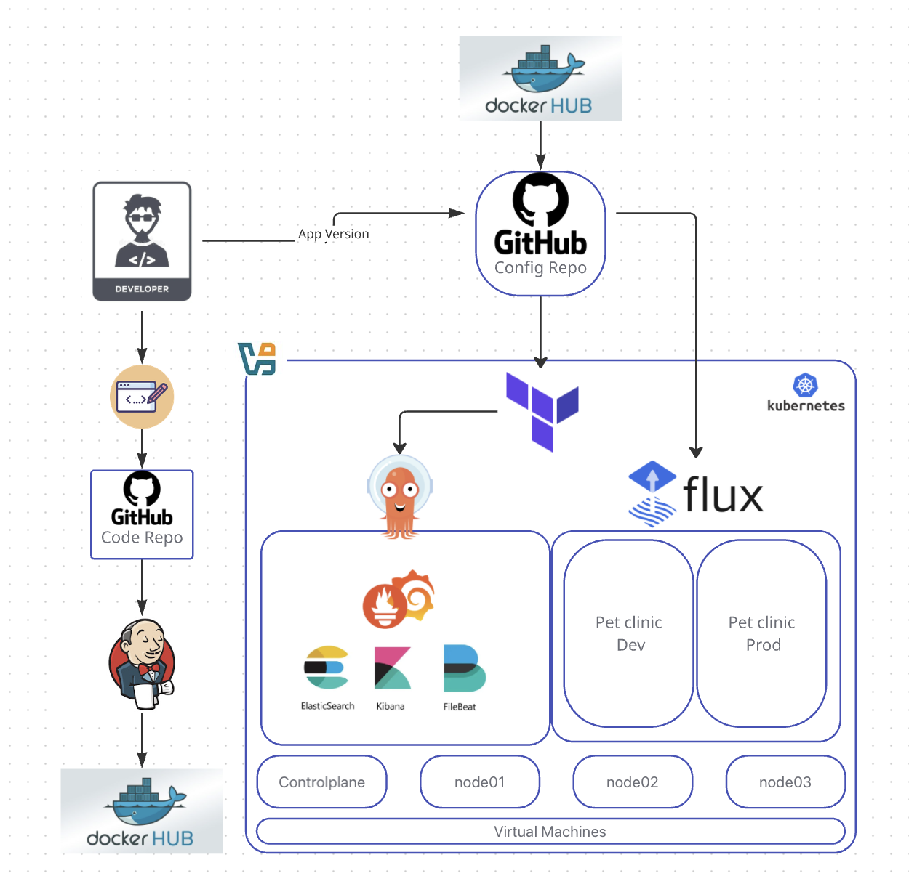

# 👋 Hi, I’m Riz

I’m a **DevOps enthusiast** with hands-on experience in **CI/CD pipelines, GitOps workflows with Argo CD, and Kubernetes deployments**.  

This platform runs on a **self-hosted Kubernetes cluster** provisioned on multiple Ubuntu VMs using VirtualBox on a Windows host. This project emphasizes **hands-on DevOps skills** and infrastructure management.

In this portfolio, you’ll find projects where I’ve:

- Built **CI/CD pipelines** using **Jenkins**
- Deployed applications using **Argo CD** following **GitOps principles**
- Managed **Argo CD Applications with Terraform** using reusable modules
- Provisioned and managed **Kubernetes clusters** on **Ubuntu VMs**
- Containerized applications using **Docker**
- Integrated **Helm charts** and Kubernetes manifests for application delivery

---

## Repositories

**Application code repo:** Contains the actual application code) (Java Spring Boot
- https://github.com/rizjosel/spring-petclinic (forked form [spring projects](https://github.com/spring-projects/spring-petclinic)) 

**Application config repo:** Stores Kubernetes manifests for deployment and environment configuration
- [https://github.com/rizjosel/petclinic-config](https://github.com/rizjosel/petclinic-config)

**Docker Registry:** Container registry for storing Docker images
- https://hub.docker.com/r/rizjosel/petclinic
---

## Tools & Technologies
- **Version Control:** GitHub  
- **Infrastructure as Code:** Terraform  
- **CI/CD & GitOps:** Jenkins, Argo CD  
- **Containers & Orchestration:** Docker, Kubernetes, Helm  
- **Networking:** Calico (CNI), MetalLB (Load Balancer), NGINX Ingress  
- **Logging & Monitoring:** Filebeat, Elasticsearch, Kibana, Prometheus, Grafana  
- **OS & Infrastructure:** Ubuntu, VirtualBox, Windows

---

## Architecture Summary
- **CI/CD Pipeline:** GitHub → Jenkins → Argo CD → Kubernetes
- **Infrastructure:** 4 Ubuntu VMs on VirtualBox (Windows Host)
- **Infrastructure as Code:** Terraform (Argo CD Application Management)
- **Container Orchestration:** Kubernetes
- **GitOps:** 
  - **Argo CD:** Monitors observability and monitoring applications (Prometheus, Grafana, ELK stack)
  - **Flux CD:** Monitors application deployments
- **Logging:** Filebeat → Elasticsearch → Kibana
- **Monitoring:** Prometheus → Grafana

---

## Project Documentation

- **CI/CD Platform Overview** → [cicd_platform.md](cicd_platform.md)  
- **CI/CD & Git Flow Details** → [cicd_gitflow.md](cicd_gitflow.md)  
- **Platform Screenshots** → [project_screenshots.md](project_screenshots.md)
