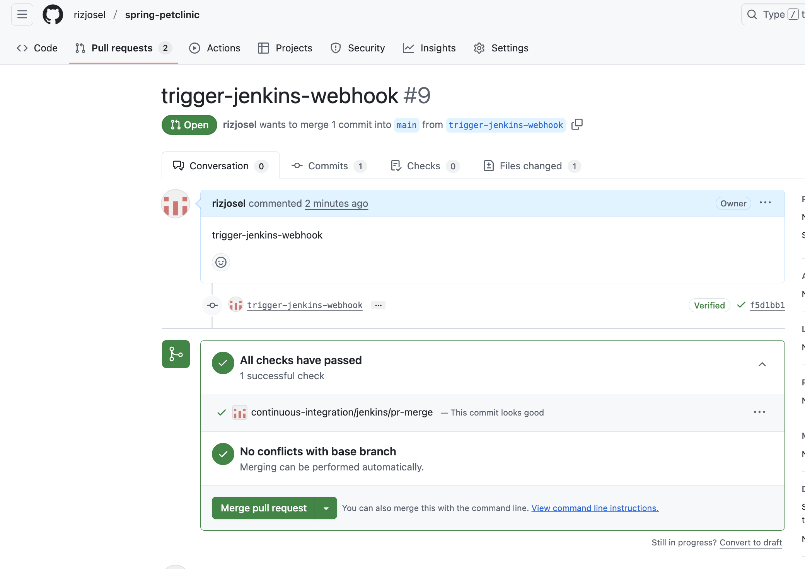
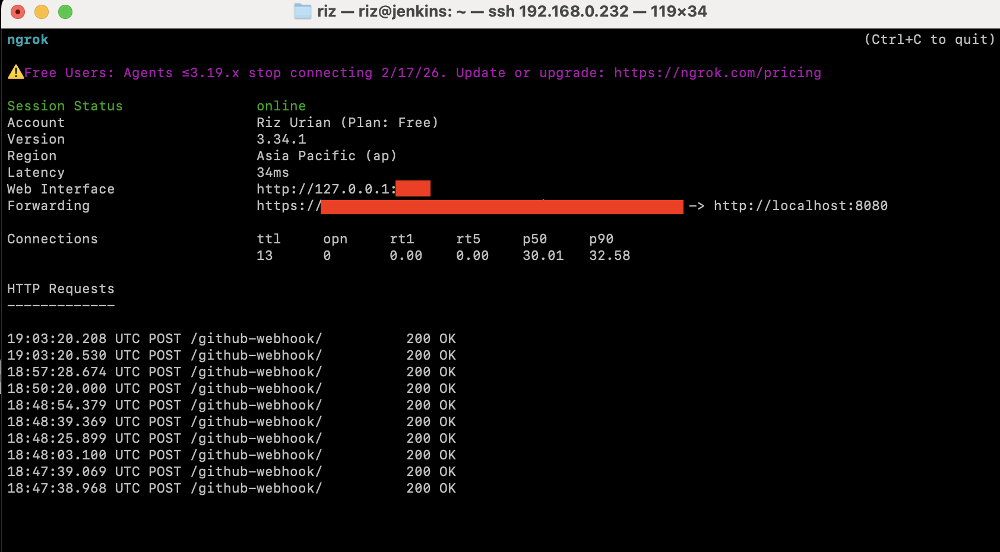
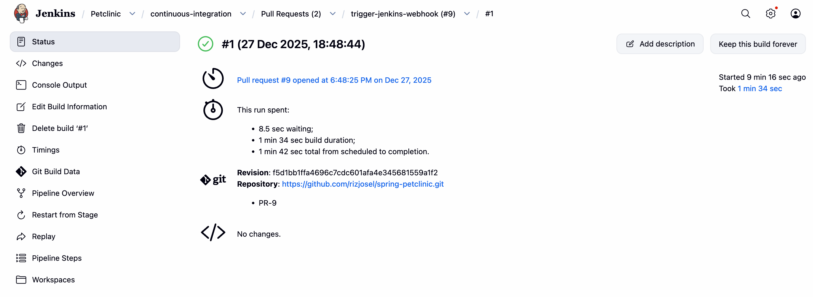
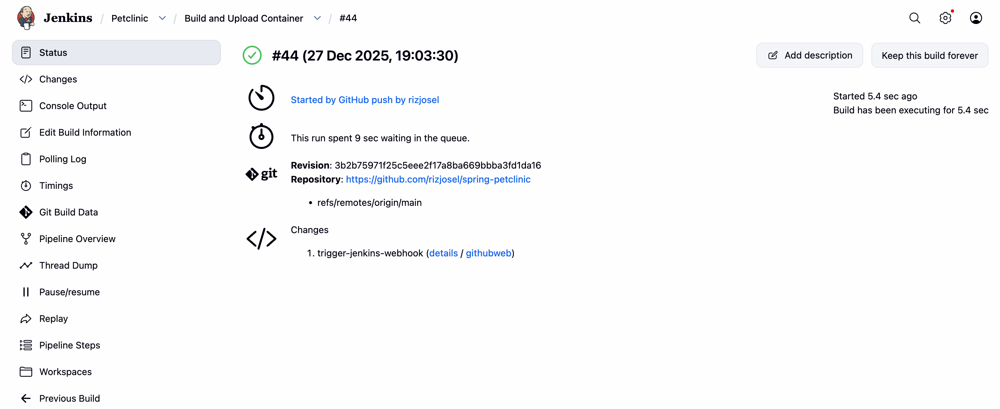
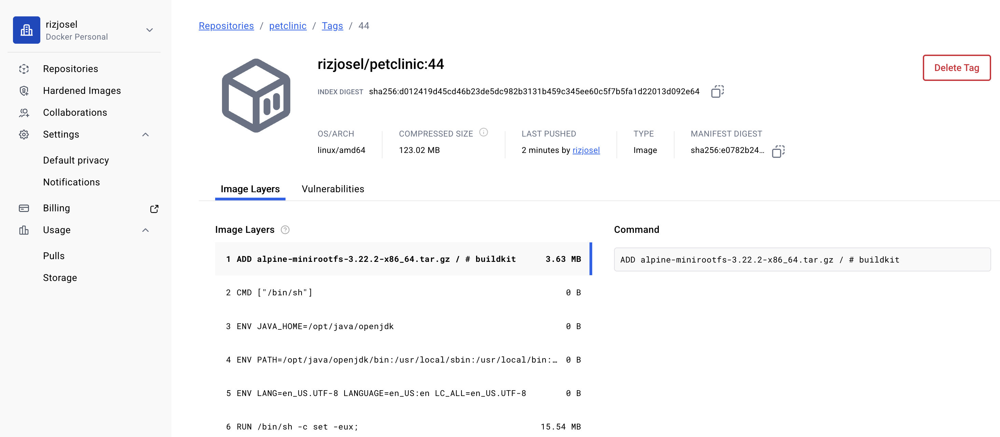
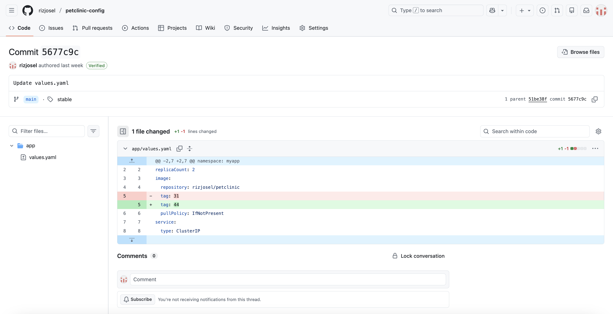
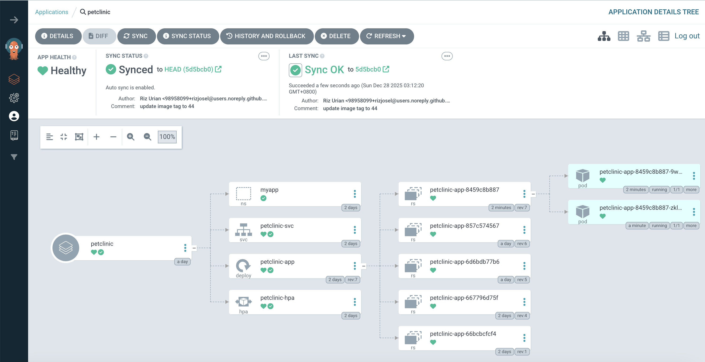
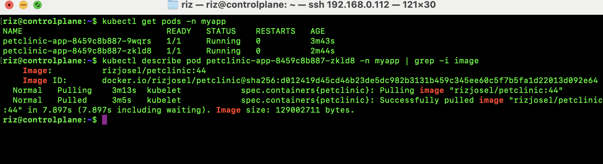

this is outdated
# CI/CD & GitOps Flow

## Code Flow
```
Developer → GitHub Pull Request → Jenkins CI → Merge PR - > Build Docker Image → Push to Docker Hub
```

User submits a PR


Trigger a Jenkins job(PR checks) via ngrok tunnel<br>
succesful webhook:


Triggered Jenkins job:


Build Docker after merge:


Uploaded image tag:



## Deployment Flow
```
GitOps Repository → Argo CD → Kubernetes Cluster → Application Exposure
```
Update image tag in application config repo:


Argo CD sync:


Kubernetes deployement:
