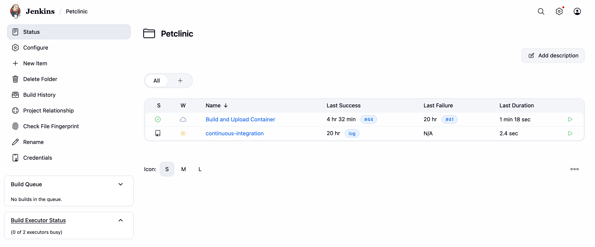
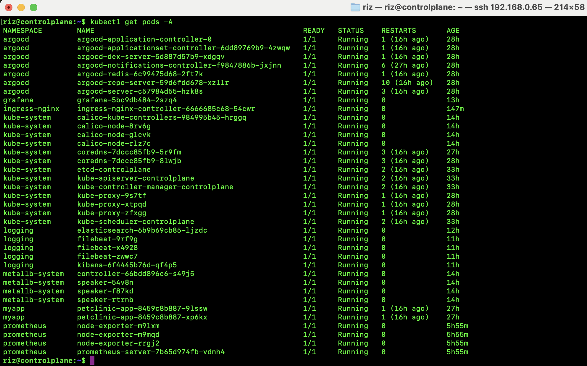
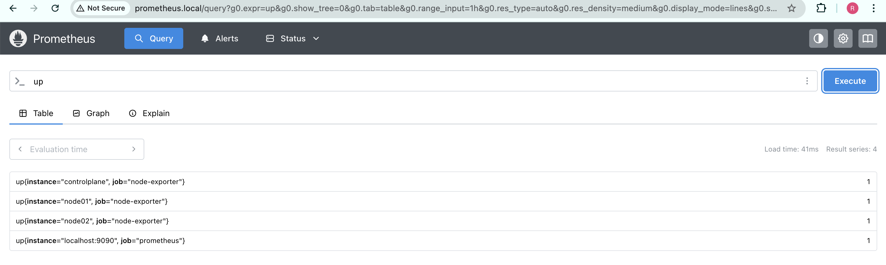
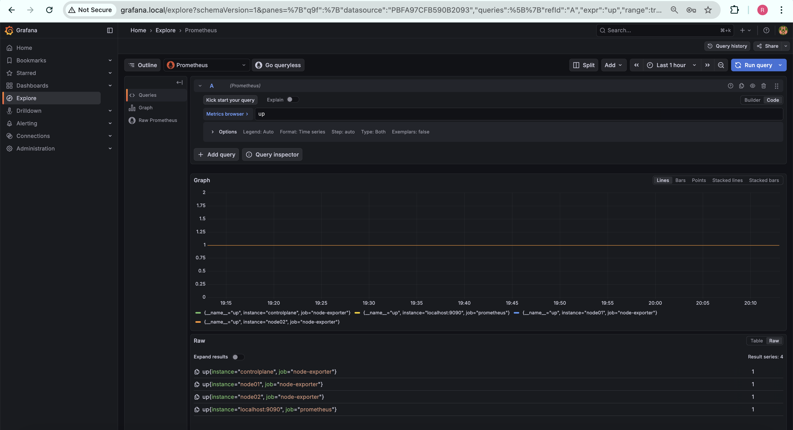
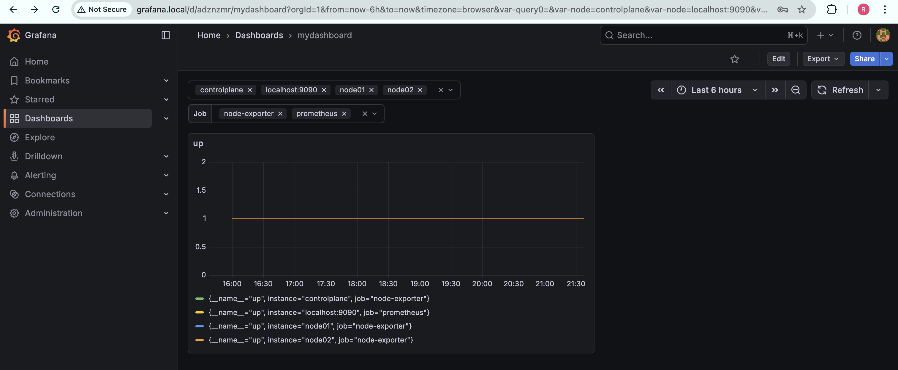
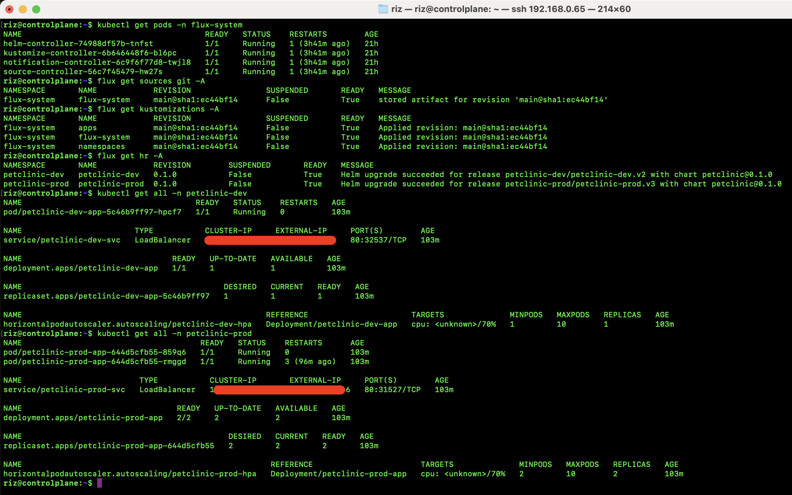
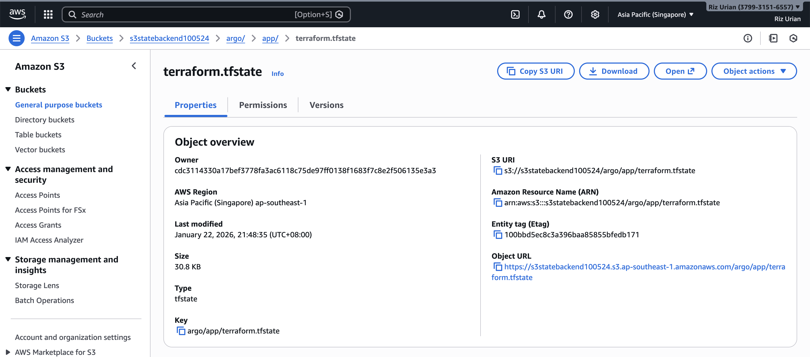
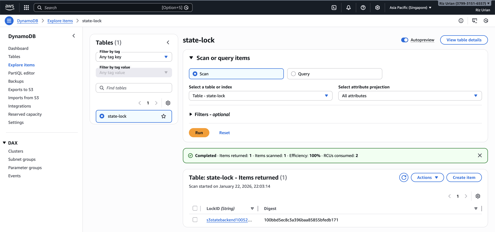
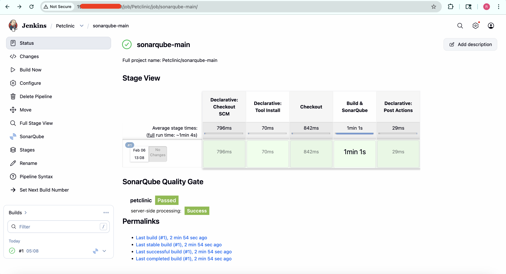
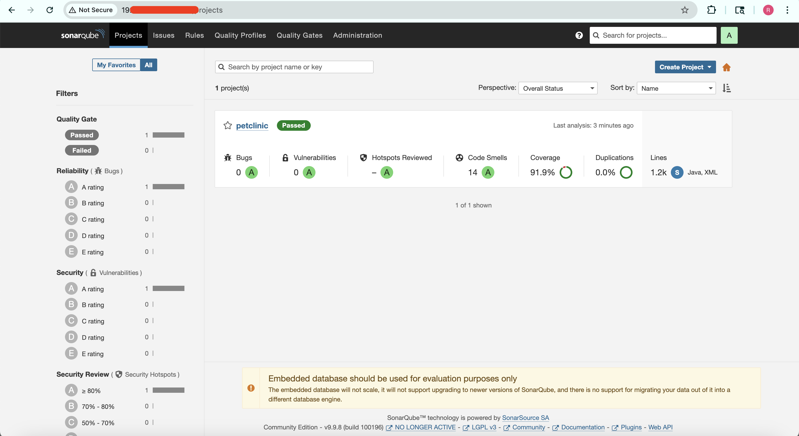

# Project Screenshots and Resources

The following screenshots provide visual evidence of the CI/CD platform in action, showcasing real-time pipeline execution, monitoring, and logging from the self-hosted Kubernetes environment.


## Application config repo Structure

```text
.
├── README.md
├── app
│   ├── Chart.yaml
│   ├── templates
│   │   ├── _helpers.tpl
│   │   ├── deployment.yaml
│   │   ├── hpa.yaml
│   │   ├── ingress.yaml
│   │   └── service.yaml
│   └── values.yaml
├── clusters
│   ├── README.md
│   ├── images
│   │   └── flux_reources.png
│   └── my-cluster
│       ├── apps
│       │   ├── kustomization.yaml
│       │   ├── petclinic-dev
│       │   │   ├── helmrelease.yaml
│       │   │   └── kustomization.yaml
│       │   └── petclinic-prod
│       │       ├── helmrelease.yaml
│       │       └── kustomization.yaml
│       ├── flux-system
│       │   ├── apps.yaml
│       │   ├── gotk-components.yaml
│       │   ├── gotk-sync.yaml
│       │   ├── kustomization.yaml
│       │   └── namespaces.yaml
│       └── namespaces
│           ├── kustomization.yaml
│           ├── petclinic-dev.yaml
│           └── petclinic-prod.yaml
├── images
│   └── architecture2.png
├── logging
│   ├── elasticsearch
│   │   ├── deployment.yaml
│   │   └── service.yaml
│   ├── filebeat
│   │   ├── configmap.yaml
│   │   ├── daemonset.yaml
│   │   ├── namespace.yaml
│   │   └── rbac.yaml
│   └── kibana
│       ├── deployment.yaml
│       ├── ingress.yaml
│       └── service.yaml
├── monitoring
│   ├── grafana
│   │   ├── configmap.yaml
│   │   ├── deployment.yaml
│   │   ├── ingress.yaml
│   │   ├── namespace.yaml
│   │   ├── pv.yaml
│   │   ├── pvc.yaml
│   │   └── service.yaml
│   └── prometheus
│       ├── configmap.yaml
│       ├── deployment.yaml
│       ├── ingress.yaml
│       ├── namespace.yaml
│       ├── node_exporter.yaml
│       ├── rbac.yaml
│       └── service.yaml
└── terraform
    └── argo
        ├── README.md
        ├── backend.tf
        ├── main.tf
        ├── modules
        │   ├── main.tf
        │   └── variables.tf
        ├── providers.tf
        └── terraform.tfstate
```

## Projects

### Jenkins folder:


### Argo Applications (UI)


### Kubernetes pods:


### Prometheus


### Grafana/Dashboards




### Kibana


### Flux


### Terraform



### Sonarqube


